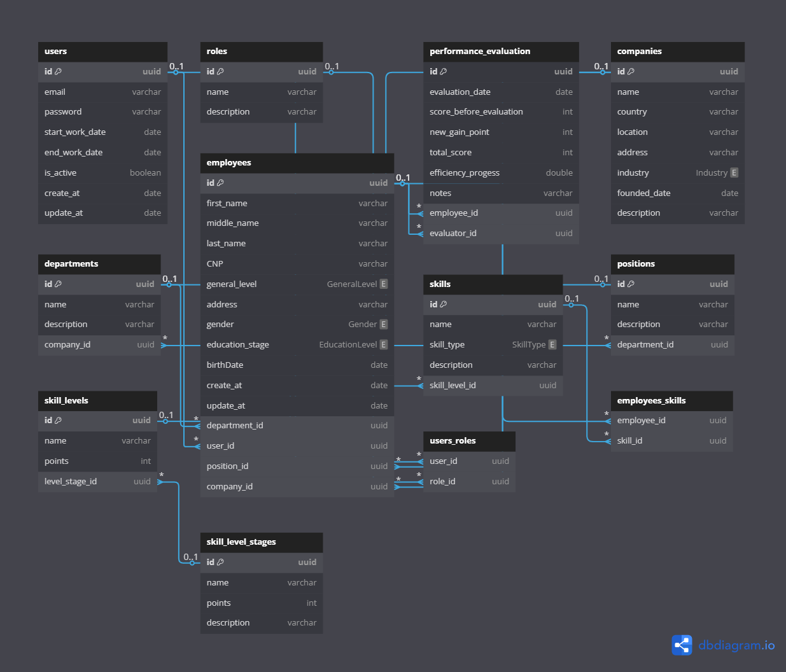

# 📌Employee Performance Tracker System (**SpringBoot** Backend API) 

--- 

## Project Overview 📋

A backend system built with Spring Boot for managing employees, performance evaluations, and skill progression within an organization.

The main goal is to track employee performance based on points earned through their skills, the level of each skill, and a sub-level associated with every skill level.

Based on total points earned, employees are assigned an organizational hierarchy level.

## Database Relationships 🧩

